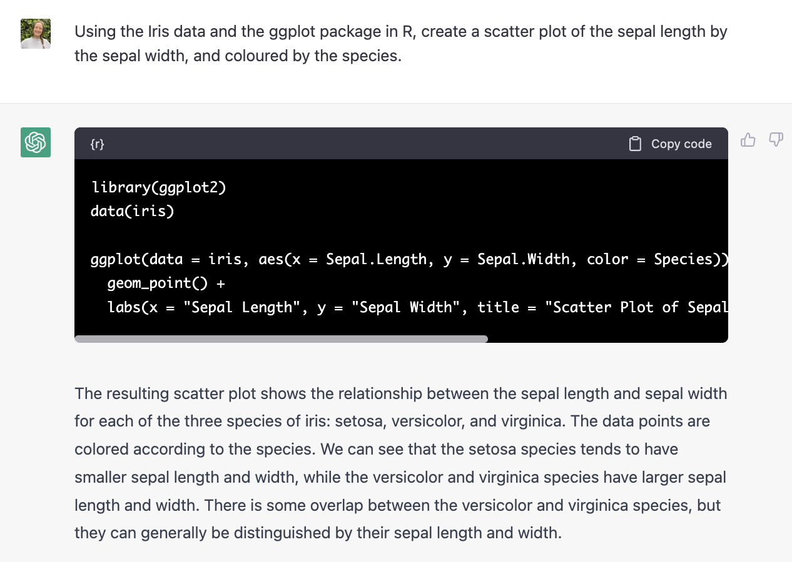
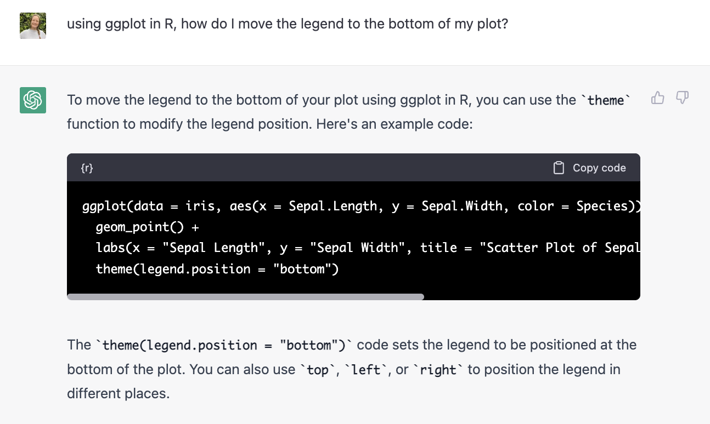
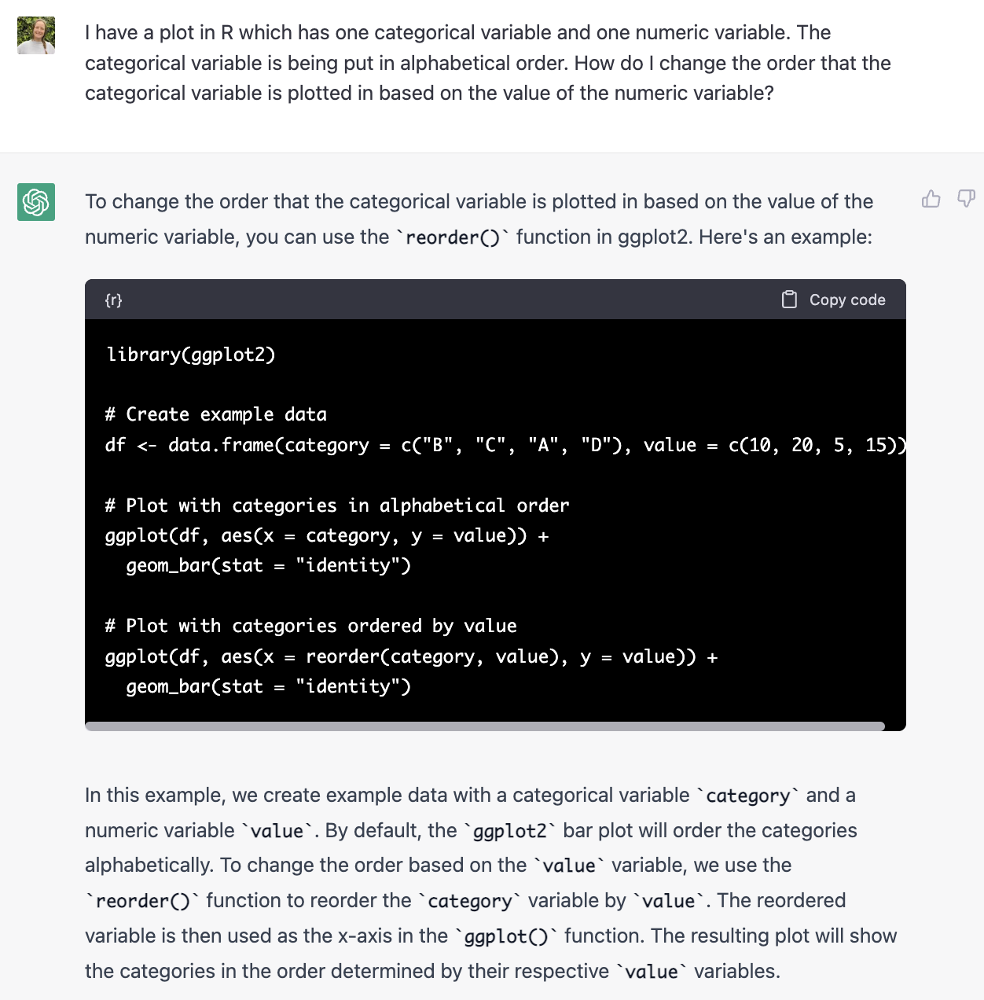
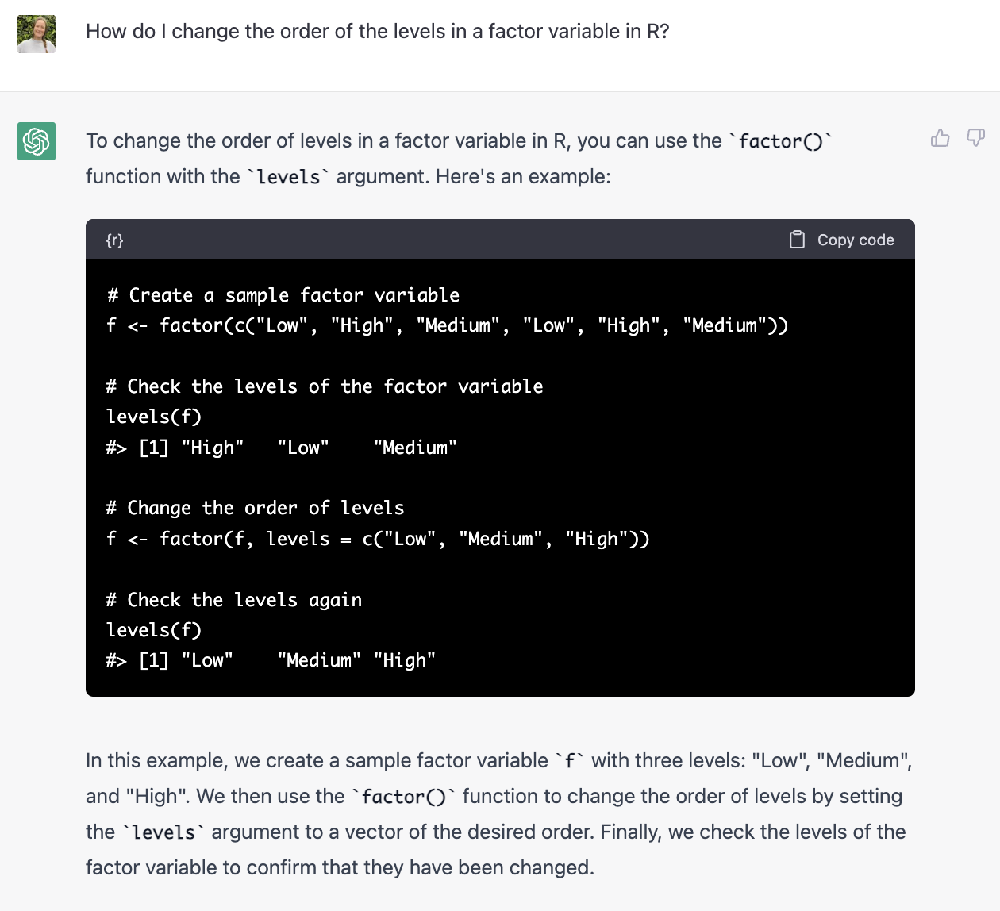

"One of the most important skills you need to have is the ability to make compelling data visualizations, generally in the form of figures. Figures will typically carry the weight of your arguments. They need to be clear, attractive, and convincing." - Claus O Wilke in 'Fundamentals of Data Visualisation'

Today's session (3rd of March 2023):  

- ggplot and aesthetics
- facet
- regression model outputs

Next session (17th of March) is a discussion on the 'Fundamentals of Data Visualisation' by Claus O Wilke, available at  https://clauswilke.com/dataviz/index.html . Please read chapter 1 Introduction, chapter 2 visualising data, and chapter 5 directory of visualisations.
The session after (21st of April) continues the discussion of crafting a figure. Please read chapter 4 color scales, chapter 19 common pitfalls of color use, chapter 21 multi-panel figures and chapter 29 telling a story and making a point.

*Resources:*
https://ggplot2.tidyverse.org/reference/index.html
https://posit.co/resources/cheatsheets/?type=posit-cheatsheets&_page=2/ 
https://ggplot2-book.org
http://www.sthda.com/english/wiki/ggplot2-essentials

```{r setup, include=FALSE}
knitr::opts_chunk$set(echo = TRUE)
```

## Introduction to GGplot

When you begin to need more functionality than Base R plotting can give you, its time to turn to ggplot. Infinitely more tweak-able and incredibly well documented, with ggplot you can create sleek and paper-quality plots and graphs. GGplot using the 'grammar of graphics' which allows you to build graphs by combining different components.

This tutorial is an introduction to ggplot with examples to get you started.

## Setting up
The packages name is `ggplot2` which needs to be installed with `install.packages("ggplot2")` and then loaded with `library(ggplot2)`.

```{r load, message=TRUE, warning=FALSE}
# install.packages("ggplot2")
library(ggplot2)
```

## Plots 101

For data visualisation, we have data and we use the values in the data to become features on the plot. These features of the plot are called aesthetics. In `ggplot` , we need to specify which parts of the data become which features on the plot using the `aes` call which stands for aesthetics. On a graph, we usually have an `x` and `y` aesthetic.

In ggplot, the method to build the plot needs to specify 3 components: the data, the aesthetics and the geom (or plot type).

You need to:
1. Start by calling a ggplot using `ggplot()`
2. Specify the data using the "data" argument `ggplot(data =  )`
3. Specify the x and y variables using the aesthetics argument `ggplot(data = , aes(x= , y = ) )`
3. Specify  what sort of plot you make ggplot to make using a second line joing to the `ggplot()` with a `+`

Lets show some examples using the cars dataset pre-loaded in R

```{r data}
# load the data
data(iris) 

# Take a look at the data
head(iris)
```

## Basic types of plots

The benefit of ggplot is that once you have set your data and aesthetics, the type of plot can easily be changed by modifying the geom function. Here are two different geoms to visualise one categorical variable and one continuous variable. In this case, the variables are iris species (x axis) and sepal width (y axis). The function `geom_boxplot()` visualises the data and the aesthetics as a box plot, while `geom_violin` visualises them as a violin plot.  

There are many forms of visalisation or geom you can use. I recommend getting inspiration from here https://r-graph-gallery.com/ .  

```{r categorical_data}
# Box Plot 
ggplot(data = iris, aes(x = Species, y = Sepal.Width)) +
  geom_boxplot()

# Voilin plot
ggplot(data = iris, aes(x = Species, y = Sepal.Width)) +
  geom_violin()
```
  
Visualisations for continuous data include scatter plots with the `geom_point()` function, line plots with `geom_line()` or `geom_trace()`.   


```{r continuous_data}
## scatter plot
ggplot(data = iris, aes(x = Sepal.Length, y = Sepal.Width)) +
  geom_point()
```

You can also display the same data multiple times on one graph by layering different geoms on top of each other. The example below shows both points using `geom_point` and a simple regression line using `geom_smooth`.

```{r multiple_geoms}
## basic regression line
ggplot(data = iris, aes(x = Sepal.Length, y = Sepal.Width)) +
  geom_point() +
  geom_smooth()

```

### Splitting by a categorical variable
Looking at the plot above, we can see there is not a clear relationship between sepal width and sepal length. We hypothesis that this relationship may actually be different depending on the species of iris. To investigate this hypothesis, we want to plot the relationship between sepal wdith and length, but distinguish between the species. 


There are two options to do this:  

1. Facet - Create multiple panes
2. Group by another attribute in the graph - e.g. colour

Facetting using the function `facet_wrap` breaks your plot into multiple panes based on a variable which is specified inside the facet function. You can specify the number of rows or columns that you want using `nrow` and `ncol` functions respectively inside the `facet_wrap` function. You can also give the title above each facet a specific name using `labeller`.
```{r facet1}
# Separate the plot into 3 panes, one for each of the 3 species
ggplot(data = iris, aes(x = Sepal.Length, y = Sepal.Width)) +
  geom_point() +
  facet_wrap(~Species)

# Separate the plot into 3 panes, one for each of the 3 species. Force the panes to be in 2 columns and change the names of the panes.
ggplot(data = iris, aes(x = Sepal.Length, y = Sepal.Width)) +
  geom_point() +
  geom_smooth() +
  facet_wrap(~Species, ncol = 2,
             labeller = labeller(Species = c("setosa" = "Iris setosa",
                                             "versicolor" = "Iris versicolor",
                                             "virginica" = "Iris virginica")))
```

The other option to highlight the difference between groups is to change an aesthetic of the graph by the group variable, so that each unique option in the variable has its own values. The aesthetics that can be changed include the colour (using `colour = ` or `fill = `), the size (`size = `), the shape (`pch = `), the line type (`linetype = `) and the transparency (`alpha = `).

```{r colour_by_aes}
## Coloured by species
ggplot(data = iris, aes(x = Sepal.Length, y = Sepal.Width, colour = Species)) +
  geom_point() +
  geom_smooth()
```

To investigate another continueous variable on the graph at the same time, it can also be added as an aesthetic. Here the point colour is given by the petal length. The shape and line type aesthetics only suits a categorical variable. All other aesthetic options can be used for either categorical or continuous variables.
```{r colour_by_aes2}
## Colour by petal length
ggplot(data = iris, aes(x = Sepal.Length, y = Sepal.Width, colour = Petal.Length)) +
  geom_point()

```
It is important to keep in mind that the aesthetics `colour` and `fill` vary in their effect depending on the geom used.
```{r colour_vs_fill}
# Box Plot with colour
ggplot(data = iris, aes(x = Species, y = Sepal.Width, colour = Species)) +
  geom_boxplot()

# Box Plot with fill
ggplot(data = iris, aes(x = Species, y = Sepal.Width, fill = Species)) +
  geom_boxplot()

```

You can also modify multiple aesthetics by either the same or different variables. However, be sure that adding more is actually enhancing the point you are making with the graph, and not making it more difficult to understand.

```{r multiple_aes}

# Colour and shape is by species
ggplot(data = iris, aes(x = Sepal.Length, y = Sepal.Width, color = Species, shape = Species)) +
  geom_point()

```

You can also modify the components of the graph as arguments within the geom function so the components are static and not based on characteristics of the data. For example, the plot below still has the colour varying with the petal length which is an aesthetic set within the `aes()` call. However the transparency (`alpha`), size and shape (`pch`) are static and set in the geom function.
```{r set_aes}
# Static aesthetics
ggplot(data = iris, aes(x = Sepal.Length, y = Sepal.Width, color = Petal.Length)) +
  geom_point(alpha = 0.5, size  = 2, pch = 17)

```

Try using chatGPT to help find the code you want.


## Data manipulation
It can be useful to undertake some data manipulation prior to plotting. In the example below, the mean and standard deviation of the sepal width is calculated prior to plotting. The mean is then plotted using ggplot as a point, with the standard deviation plotted as error bars around the mean using the function `geom_errorbar`.
```{r error bars, message=FALSE, warning=FALSE}
library(dplyr)
data_mod <- iris %>% 
  group_by(Species) %>% # try chaning this to Sepal.Length
  summarise(mean_SW = mean(Sepal.Width), # calculate the mean for each species
            sd_SW = sd(Sepal.Width)) %>% # calculate the standard deviation for each species
  mutate(sd_SW = ifelse(is.na(sd_SW), 0, sd_SW)) # if the standard deviation is NA (e.g. there's only 1 observation), make the standard deviation 0

ggplot(data = data_mod, aes(x = Species, y = mean_SW)) +
  geom_point() +
  geom_errorbar(aes(ymin = mean_SW - sd_SW, # minimum 
                    ymax = mean_SW + sd_SW)) # maximum 
```


## Basic modifcations
Once you're happy with the structure of the graph, then it is time to touch up the style and make modifications. You can add labels such as the title, subtitle, x and y axis labels as well as the legend titles using the `labs()` function.

```{r labs}
## Labels
ggplot(data = iris, aes(x = Sepal.Length, y = Sepal.Width)) +
  geom_point() +
  labs(title = "Sepal length by width", x = "Sepal length (cm)", y = "Sepal width (cm)")
```
The legend position can be modified within the theme settings which we will go into more next session. Hiding the legend is done within the geom function.

```{r legend}
## Move legend
ggplot(data = iris, aes(x = Sepal.Length, y = Sepal.Width, color = Species)) +
  geom_point() +
  theme(legend.position = "bottom") # try "top"
```

```{r legend_rm}
## Hide legend
ggplot(data = iris, aes(x = Sepal.Length, y = Sepal.Width, color = Species)) +
  geom_point(show.legend = FALSE) # check
```

Try using chatGPT to help find the code you want.



There are also methods to change how the plot looks. We will dive into themes next week, however for now there are premade themes which can be found here https://ggplot2.tidyverse.org/reference/ggtheme.html and added a function to the end of your plotting code.
```{r themes}
## Add premade theme
ggplot(data = iris, aes(x = Species, y = Sepal.Width)) +
  geom_boxplot() +
  theme_bw() # try theme_light, theme_dark, theme_classic,
```

The length, tick marks and names of the x and y axis can be modified using scale functions, for example continuous scales are documented here https://ggplot2.tidyverse.org/reference/scale_continuous.html .  
```{r breaks}
## Alter the axis scale
ggplot(data = iris, aes(x = Sepal.Length, y = Sepal.Width)) +
  geom_point() +
  scale_x_continuous(limits = c(2, 8),
                     breaks = seq(2, 8, 1), # sequence from 0 to 8 by 1. Equivalent to 0:8
                     minor_breaks = seq(0, 8, 0.2)
                     )
  
  
```

Annotations can be useful to show significance, highlight outliers, add titles to graphs or name groups. The `annotate` function is used for both text or segments. 
```{r annotate}
## Annotate with text
ggplot(data = iris, aes(x = Sepal.Length, y = Sepal.Width, color = Species)) +
  geom_point() +
  annotate("text", x = 4.5, y = 4, label = "Group 1", size = 7) +
  annotate("text", x = 6.5, y = 3.6, label = "Group 2", color = "blue") + 
  annotate("text", x = 5.5, y = 2, label = "Group 3") 
  
## Annotate bar plot with * for significance
ggplot(data = iris, aes(x = Species, y = Sepal.Length)) +
  geom_bar(stat = "identity") +
    annotate("text", x = 1, y = 270, label = "*", size = 20) 

## Annotate with text and a line
ggplot(data = iris, aes(x = Sepal.Length, y = Sepal.Width, color = Species)) +
  geom_point() +
  annotate("text", x = 4.5, y = 4.2, label = "Important segment") +
  annotate("segment", x = 4.1, xend = 5, y = 4, yend = 4,
           arrow = arrow(ends = "both", angle = 90, length = unit(.2,"cm")))

## Annotate with an arrow
ggplot(data = iris, aes(x = Sepal.Length, y = Sepal.Width, color = Species)) +
  geom_point() +
  annotate("text", x = 7, y = 4.5, label = "Outliers", size = 7) + # try size = 3
  annotate("segment", x = 7.4, xend = 7.8, y = 4.5, yend = 3.9, # try chaning these values
           size = 1.5, # try 0.5 or 2
           color = "darkblue", # try "green" or "purple"
           arrow = arrow())
  
  
```


## Save your plot
Use the function `ggsave` .
```{r save}

# # Save the most recent plot by using ggsave directly afterwards
# ggplot(data = iris, aes(x = Sepal.Length, y = Sepal.Width)) +
#  geom_point()
# 
# ggsave("your/folder/directory/here/plot.png")

# # Save a specific plot by assigning it a name
# # Save the most recent plot by using ggsave directly afterwards
# p <- ggplot(data = iris, aes(x = Sepal.Length, y = Sepal.Width)) +
#  geom_point()
# 
# ggsave(p, "your/folder/directory/here/plot.png")


```


## Visualising regression model

This much of our work, we are developing models to either investigate relationships or predict. GGplot can be used with model evaluation metrics and outputs for publication ready graphs to highlight model results. These examples are based on a linear model, however the methods are appropriate for generalised linear models (glms or glmms - remember to back transform your estimates!), generalised additive models (gams) ect.  

Lets start by creating a simple linear model. We think that sepal width can be explained by the petal length. The model predictions can be extracted from the model using the `fitted` function. Remember these values are not the same as your data due to errors/residuals. Here we have made a new dataframe called `m_predction` which has the true values of the variables, in this case the petal length, joined with the prediction for the response variable. The predictions can then be plotted using the `geom_line` function.   
```{r basic_linear_model}
# model predicting sepal width by the petal width
m1 <- lm(Sepal.Width ~ Petal.Length, data = iris)
summary(m1)

## Visualise what this might look like using a scatter plot
ggplot(data = iris, aes(x = Petal.Length, y = Sepal.Width)) +
  geom_point()

## Save the predictions from the model together with the petal length
m_prediction <- data.frame( Petal.Length = iris$Petal.Length,
                            Sepal.Width_pred = fitted(m1))

## Add the regresion line to the plot
ggplot(data = iris, aes(x = Petal.Length, y = Sepal.Width)) +
  geom_point() +
  geom_line(data = m_prediction, aes(x = Petal.Length, y = Sepal.Width_pred ))

```
  
We can also make new variables for the model by normal data manipulation beforehand. In this case we have created a variable for the shape of the petal which is a ratio of the petal length by the petal width. We then make a larger linear model with sepal width still as the response variable and 5 predictor variables. We then extract the `coefficients` and standard deviation from the `summary()` table. Doing this process manually took me 5 lines of code. An alternative is the `broom` packages with the function `tidy` function.  

```{r linear_model}
data_model <- iris %>% 
  mutate(petal_shape = Petal.Length / Petal.Width)

m2 <- lm(Sepal.Width ~ Sepal.Length + Petal.Length + Petal.Width + Species + petal_shape, data = data_model)
summary(m2)

m_out <- summary(m2)
m_eval <- m_out$coefficients
m_eval_df <- as.data.frame(m_eval)
m_eval_df$vars <- rownames(m_eval_df)
m_eval_df <- rename(m_eval_df, st_error = `Std. Error`)
m_eval_df

library(broom)
tidy(m2)

```
We can plot the model coefficients and the deviation as a point with a line around the estimate. If the variables are significant, the error lines around the mean wont cross 0. When we do this, the order of the variables in the y axis is in alphabetical order. Instead we may prefer to order them by the estimate. We then need to alter the order of the variables. The variable should be a `factor` and we set the order by the `levels`.
```{r model_coefficients}
## Plot coefficient estimates
ggplot(data = m_eval_df, aes(y = vars, x = Estimate)) +
  geom_point() + 
  geom_pointrange(aes(xmin = Estimate - st_error, xmax = Estimate + st_error)) +
  labs(y = "", x = "Coefficient estimate")

# make vars a factor with the levels in the order you want
# Option 1 using base R
order <- m_eval_df[order(m_eval_df$Estimate),'vars']

# Option 2 using dplyr and pipes
order <- m_eval_df %>%  arrange(Estimate) %>% select(vars) %>% pull

# Set the levels in the correct oder
m_eval_df$vars <- factor(m_eval_df$vars, levels = order)

## Plot with the new order of variables
ggplot(data = m_eval_df, aes(y = vars, x = Estimate)) +
  geom_point() + 
  geom_pointrange(aes(xmin = Estimate - st_error, xmax = Estimate + st_error)) +
  labs(y = "", x = "Coefficient estimate", title = "In order")
```

Try using chatGPT to help find the code you want.  

With general language:  



With specific R terminology:  




The `effects` package can also be useful to plot the impact of the variable on the reponse variable. To view the effect of all the variables, you can `plot` all of the effects of a model using `plot(allEffects(m))`. To plot one variable, you can use the `effect` function instead and specify the variable by the name. Here we have specified to only see the petal width.
```{r model_effects, message=FALSE, warning=FALSE}
library(effects)
plot(allEffects(m2))

## Extract the effect
eff_PW <- effect("Petal.Width", m2)
eff_PW_df <- as.data.frame(eff_PW)
eff_PW_df

## Plot the effect with ggplot
ggplot(data = eff_PW_df, aes(x = Petal.Width, y = fit)) +
  geom_line()
```
  
Looking at the impact of sepal length on width, we may think that the impact is different depending on the species. To visualise the difference, we can either colour or facet by the species as discussed earlier. In the model, we may add an interaction term between sepal length and species using `Sepal.Length*Species` as a variable in the linear model function `lm`. This interaction can also be visualised using the `effect` function.  


```{r model_interaction}
## A basic plot doesnt show much relationship
ggplot(data = iris, aes(x = Sepal.Length, y = Sepal.Width)) +
  geom_point()

## Colour by the species to see if the trend is different between species
ggplot(data = iris, aes(x = Sepal.Length, y = Sepal.Width, colour = Species)) +
  geom_point()

## Add a simple regression line
ggplot(data = iris, aes(x = Sepal.Length, y = Sepal.Width, colour = Species)) +
  geom_point() +
  geom_smooth()

## Model with the interaction of sepal length and species
m3 <- lm(Sepal.Width ~ Sepal.Length*Species, data = data_model)
summary(m3) # interaction is significant

## Extract the effect of the interaction
eff_int <- effect("Sepal.Length*Species", m3)
eff_int_df <- as.data.frame(eff_int)

## Plot the interaction
ggplot(data = eff_int_df, aes(x = Sepal.Length, y = fit, colour = Species)) +
  geom_line()
```


